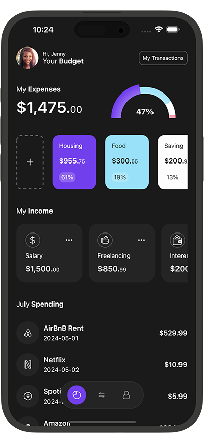

# Finance App in React Native with Expo Router 
A sleek, mobile-first Finance App UI built with Expo Router v3 and React Native, featuring a custom bottom tab navigator and interactive pie charts powered by react-native-gifted-charts.
This is an [Expo](https://expo.dev) project created with [`create-expo-app`](https://www.npmjs.com/package/create-expo-app) to create a Finance App UI in React Native. Along with App UI, here I've implemented custom bottom tabbar navigator with expo router v3 and pie chart with [react native gifted charts](https://github.com/Abhinandan-Kushwaha/react-native-gifted-charts) package.

Libraries used in this project

- [Expo](https://expo.dev)
- [React Native Gifted Charts](https://github.com/Abhinandan-Kushwaha/react-native-gifted-charts)
- [React Native SVG Tansformer](https://github.com/kristerkari/react-native-svg-transformer)

📱 App Preview

🚀 Features

* Custom Bottom Tab Navigator using Expo Router v3

* Interactive Pie Charts to visualize spending categories

* Responsive UI with modern design principles

* SVG Support via react-native-svg-transformer

🧰 Tech Stack

* Expo — Managed workflow for rapid development

* React Native Router (Expo Router) — File-based routing and deep linking

* React Native Gifted Charts — Beautiful, customizable charts

* React Native SVG Transformer — Import and render SVG assets

* TypeScript — (Optional) static typing for safer code

📋 Prerequisites:
Before you begin, ensure you have the following installed:

* Node.js (v14 or newer)
* npm (v6 or newer) or Yarn (v1.22 or newer)
* Expo CLI (npm install -g expo-cli)
* Expo Go app installed on your mobile device for testing

🔧 Installation
1. Clone the repository:
* git clone https://github.com/PHom798/Finance-APP-UI.git
* cd Finance-APP-UI

📱 Supported Platforms

* iOS
* Android

🤝 Contributing
* Contributions, issues, and feature requests are welcome! Feel free to check issues page.

1. Fork the repository
2. Create your feature branch (git checkout -b feature/amazing-feature)
3. Commit your changes (git commit -m 'Add some amazing feature')
4. Push to the branch (git push origin feature/amazing-feature)
* Open a Pull Request

